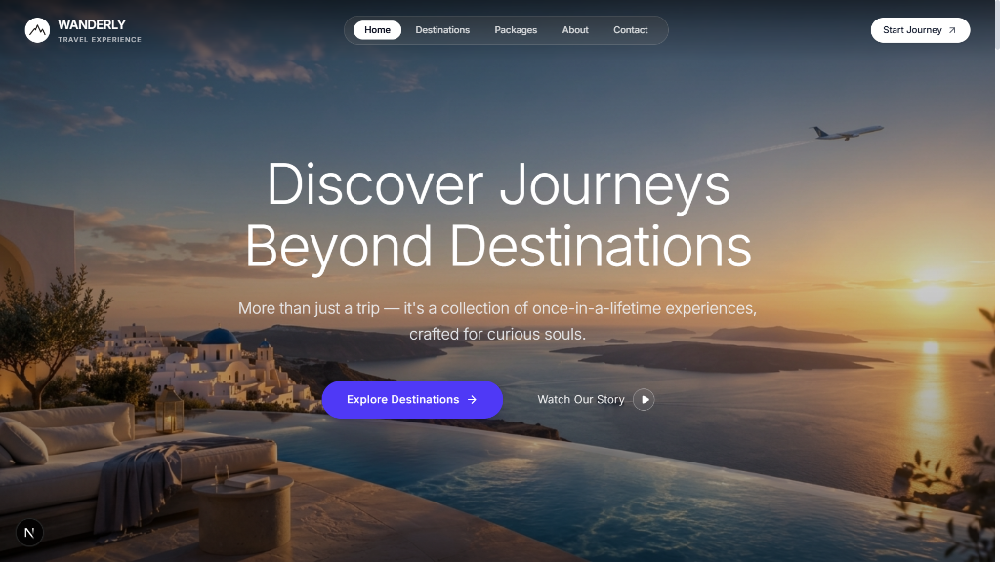

# Wanderly — Bespoke Luxury Travel

A modern, high-end travel agency web application inspired by minimalist design and luxury hospitality brands.

**Live Website:** [https://wanderly-travels-website.vercel.app/](https://wanderly-travels-website.vercel.app/)

---



---

## Features

- **5 Dedicated Pages**: Home, Destinations, Packages, About, and Contact.
- **Interactive Filtering**: Filter destinations by region, travel style, and price range.
- **Package Details & Modals**: Day-by-day expedition itinerary timelines and full amenity breakdowns.
- **Booking Flow**: Party size selector, date picker, real-time cost calculation, and reference generation.
- **Responsive & Modern**: Glassmorphic sticky navbar, custom mountain brand mark, and smooth micro-interactions.

---

## Tech Stack

- **Framework**: Next.js 16 (App Router)
- **Language**: TypeScript
- **Styling**: Tailwind CSS
- **Icons & Animation**: Lucide React, Framer Motion

---

## Getting Started

```bash
# Clone the repository
git clone https://github.com/ahmedaalam/wanderly-travel-website.git
cd wanderly-travel-website

# Install dependencies
npm install

# Run the development server
npm run dev
```

Open [http://localhost:3000](http://localhost:3000) in your browser.

---

## Deployment

Deployed on [Vercel](https://vercel.com). Any changes pushed to `main` automatically trigger a production build.
